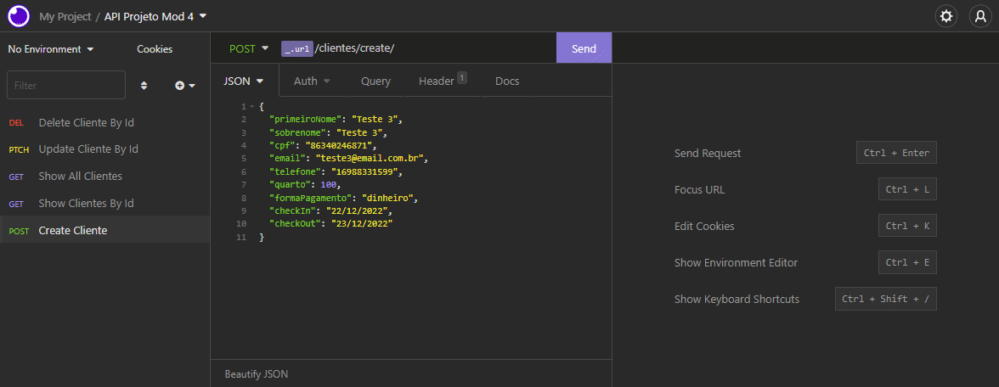

<br />
<p align="center">
    

  <h3 align="center">API Hotel com Node, Express, Sequelize e SQLite</h3>
 <br />
  <p align="center">
     Sumário
      <p align="center">
  <a href="#sobre"> Sobre </a> |
  <a href="#conhecimentos-praticados"> Conhecimentos praticados </a> |
  <a href="#rotas-da-aplicação"> Rotas da aplicação </a> |
  <a href="#tecnologias-utilizadas"> Tecnologias utilizadas </a>      
       <br />
    <br />
    <h1 align="center">
    
 </h1>
  </p>
</p>

# Sobre

O objetivo do projeto foi criar uma API para um hotel utilizando Node, Express, Sequelize e SQLite como projeto final do Módulo 4 da Turma 10 do curso de Desenvolvimento Web Fullstack Resilia.

Cada integrante do grupo ficou responsável pela criação de uma API referente à um dos serviços do hotel.

Sendo eles: clientes, funcionários, cardápio, filiais e quartos.

Nesta aplicação é possível cadastrar, listar, atualizar e deletar pratos do cardápio.

# Conhecimentos Praticados

✔ NodeJs <br>
✔ Express <br>
✔ SQLite3 <br>
✔ Sequelize <br>
✔ CRUD com Sequelize <br>
✔ Padrão MVC

# Rotas da aplicação:

## Cardápio

<b>[GET] </b> /cardapio - A rota deve exibir todos os pratos cadastrados.<br>

<b>[GET] </b> /cardapio/:id - A rota deve listar um prato baseado em seu ID.<br>

<b>[POST] </b> /cardapio/registrar - A rota deve cadastrar um prato com as informações passadas no body da requisição.<br>

```javascript
{
   "nomePrato": "Macarrão com queijo",
	"valor": 32.00,
	"serve": 2,
	"vegan": "não",
	"tipo": "comida"
}
```

<b>[PATCH] </b> /cardapio/:id - A rota deve atualizar um prato com as informações passadas no body da requisição. Caso necessário apenas uma informação pode ser atualizada por vez.<br>

```javascript
{
   "nomePrato": "Feijoada",
	"valor": 38.00,
	"serve": 2,
	"vegan": "não",
	"tipo": "comida"
}
```

<b>[DELETE] </b> /cardapio/:id - A rota deve deletar um prato baseado em seu ID.<br>

# Validação de dados

Foi adicionada as seguintes validações para os dados recebidos nas requisições: <br><br>
<b>[POST] </b> /cardapio/registrar <br>

- O campo "valor" deve receber um número<br>
- O campo "serve" deve receber um número inteiro<br>
- O campo 'vegan' deve receber uma string respondendo se o prato é vegan(sim/não)<br>
- O campo 'tipo' deve receber uma string respondendo o tipo do alimento (comida/bebida)<br><br>

# Rodando o projeto:

### Pré-requisitos:

Antes de começar, você precisará instalar em sua máquina as seguintes ferramentas:
[Git](https://git-scm.com), [Node.js](https://nodejs.org/en/) e [Insomnia](https://insomnia.rest/download). <br> Além disso, é aconselhável ter um editor como o [VSCode](https://code.visualstudio.com/) para trabalhar com o código!

### Instalando e rodando o projeto:

```bash
# Clone este repositório
$ git clone https://github.com/heitorschumann/API-Hotel-Cardapio

# Acesse a pasta do projeto no terminal
$ cd API-Hotel-Cardapio

# Na pasta raiz copie o arquivo .env.exemple e renomeie para .env
//linux
$ cp .env.example .env

//windows
copy "./.env.example" "./.env"

# Instale as dependências do projeto
$ npm install

# Inicie o servidor da aplicação
$ npm start

# Utilize o Insomnia para realizar as requisições nas rotas

#Obs: Caso queira popular o banco de dados, acesse o arquivo 'app.js' no VSCode, remova o '//' da linha 21 e execute o comando npm start

```

### Dependências:

```javascript
"dependencies": {
    "dotenv-safe": "^8.2.0",
    "express": "^4.17.3",
    "path": "^0.12.7",
    "sequelize": "^6.17.0",
    "sequelize-cli": "^6.4.1",
    "sqlite3": "^5.0.2"
  },
  "devDependencies": {
    "nodemon": "^2.0.15"
  }
```

# Tecnologias utilizadas:

<p align="center">
<a href="https://nodejs.org/en/"></a> <a href="https://expressjs.com/pt-br/"></a> <a href="https://insomnia.rest/download"></a> <a href="https://sequelize.org"></a> <a href="https://www.sqlite.org/index.html"></a>
</p>

---

**Desenvolvido por <a href="https://www.linkedin.com/in/bruno-andreotti/">Bruno Andreotti</a>, <a href="https://www.linkedin.com/in/denise-g-oliveira/">Denise Oliveira</a>, <a href="https://www.linkedin.com/in/heitorschumann/">Heitor Schumann</a>, <a href="https://www.linkedin.com/in/henrique-ferraz-a46123219/">Henrique Ferraz</a>, <a href="https://www.linkedin.com/in/murilo-antunes-bb1143228/">Murilo Antunes</a>.**
